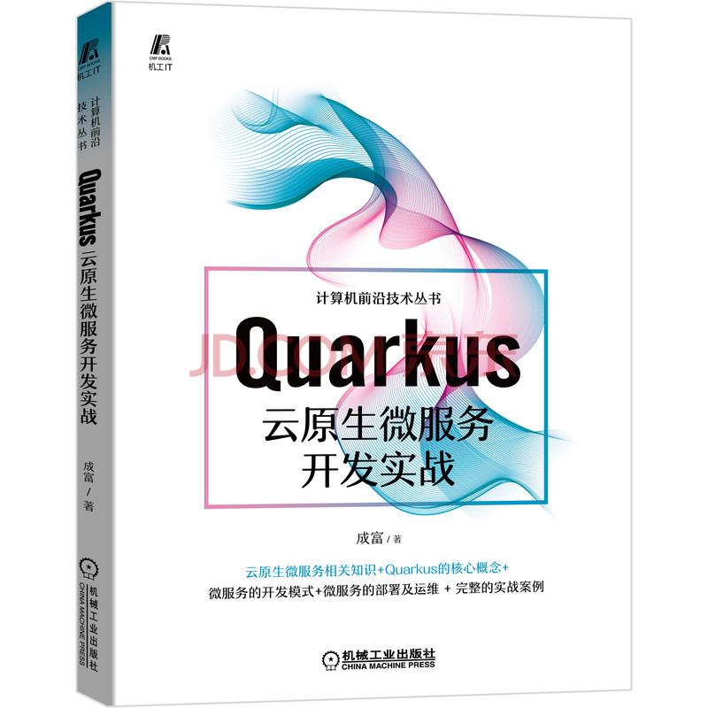

# Happy Takeaway (快乐外卖)

An example project about building cloud-native microservices apps using Quarkus.

本应用是我的新书《Quarkus云原生微服务开发实战》的实战示例。在京东或淘宝搜索书名即可。

## 开发指南

该应用是一个Maven项目，只需要使用IDE来导入项目即可。

项目的目录组织结构如下表所示：

| 分类          | 子目录       |
|-------------|-----------|
| 公共库         | `lib`     |
| 微服务 API     | `api`     |
| 微服务的实现      | `service` |
| 与开发和管理相关的工具 | `tool`    |

在进行本地开发时，使用 `make` 命令来启动 Docker Compose 和单个服务。

* `make docker-compose` : 启动 Docker Compose。
* `make restaurant-dev` : 以开发模式启动餐馆服务。

启动其他服务的命令请参考 `Makefile` 文件。

开发工具：

* pgAdmin - `localhost:6555`，用户名 `admin@example.com`，密码 `pgadmin`
* Kafka UI - `localhost:9080`

## 关注我

获取更多信息，可以关注我：

* 微信公众号【灵动代码】（vividcode）
* [B站](https://space.bilibili.com/1094957548)
* 微博 @成富_Alex